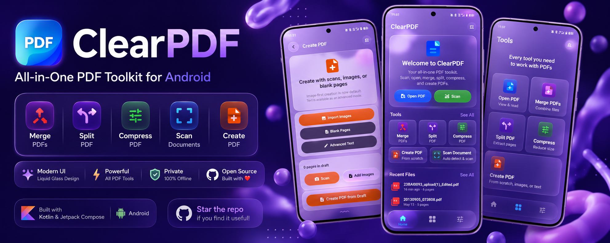

# ClearPDF

<p align="center">
  
</p>

<p align="center">
  
  
  
  
</p>

<p align="center">
  Modern open-source PDF toolkit for Android with a beautiful liquid glass inspired UI.
</p>

---

# ✨ Features

- 📖 Fast PDF reader with smooth, Adobe-style pinch-zoom & pan
- ✍️ Annotate: pen, highlighter, shapes, arrows + on-device text selection (OCR)
- 🗂️ Organize pages: reorder, rotate & delete — losslessly
- 🔀 Merge multiple PDFs (lossless — text & vectors preserved)
- ✂️ Split and extract PDF pages (lossless)
- 🗜️ Compress PDFs with quality controls
- 🖼️ Images → PDF and 📄 Create PDFs from scans or blank pages
- 🔎 Extract text from PDFs (copy / share)
- 📷 Document scanner with edge detection (Google ML Kit)
- 🌗 Beautiful liquid glass UI for light & dark mode
- ⚡ Smooth performance built with Jetpack Compose
- 🔒 Offline-first & privacy friendly — no cloud PDF processing, accounts, ads, or analytics
- 🛡️ No hidden uploads — PDF work stays on-device; scanner/text-selection ML components are disclosed in `NOTICE`

---

# 📱 Screenshots

<p align="center">
  
  
  
</p>

<p align="center">
  
  
  
</p>

---

# 🧊 Liquid Glass UI

ClearPDF uses a custom Android liquid glass inspired design system with:

- Blur & transparency effects
- Floating glass cards
- Dynamic gradients
- Smooth rounded layouts
- Adaptive light & dark themes

Designed specifically for modern Android devices using Jetpack Compose.

---

# 🛠 Tech Stack

- Kotlin
- Jetpack Compose
- Material 3
- Android PDF rendering libraries
- Android Liquid Glass effects

---

# 🚀 Getting Started

Clone the repository:

```bash
git clone https://github.com/Chethan616/ClearPDF.git
```

Open the project in Android Studio and run:

1. Sync Gradle
2. Build the project
3. Run on a real device or emulator

The project uses JDK 17 or newer and Android SDK 36. Build the release variant locally with:

```bash
./gradlew assembleRelease
```

The release build is intentionally unsigned for contributors unless local signing credentials are configured. Never commit `key.properties`, keystores, APKs, or private documents.

---

# ❤️ Open Source

ClearPDF is fully open source and built for the Android community.

If you like the project:

- ⭐ Star the repository
- 🍴 Fork the project
- 🛠 Contribute improvements
- 📢 Share it with others

See [CONTRIBUTING.md](CONTRIBUTING.md) for the offline-first contribution principles and release workflow. See [PRIVACY.md](PRIVACY.md) for the app's privacy and offline behavior. Please use the issue templates for bugs and feature requests.

---

# 🙌 Credits

Liquid glass and backdrop effects are inspired by and partially adapted from:

AndroidLiquidGlass by kyant0  
https://github.com/Kyant0/AndroidLiquidGlass

Lossless PDF page operations and text extraction are powered by:

PdfBox-Android by Tom Roush (a port of Apache PDFBox)  
https://github.com/TomRoush/PdfBox-Android

Both are licensed under the Apache License 2.0.

---

# 🤝 Contributing

Contributions are welcome.

1. Fork the repository
2. Create a feature branch
3. Commit your changes
4. Open a pull request

---

# 📄 License

MIT License — see [LICENSE](LICENSE).

---

# 💖 Support

If you find ClearPDF useful, consider supporting development:

[](https://github.com/sponsors/Chethan616)

Repository funding metadata lives in:

`.github/FUNDING.yml`
