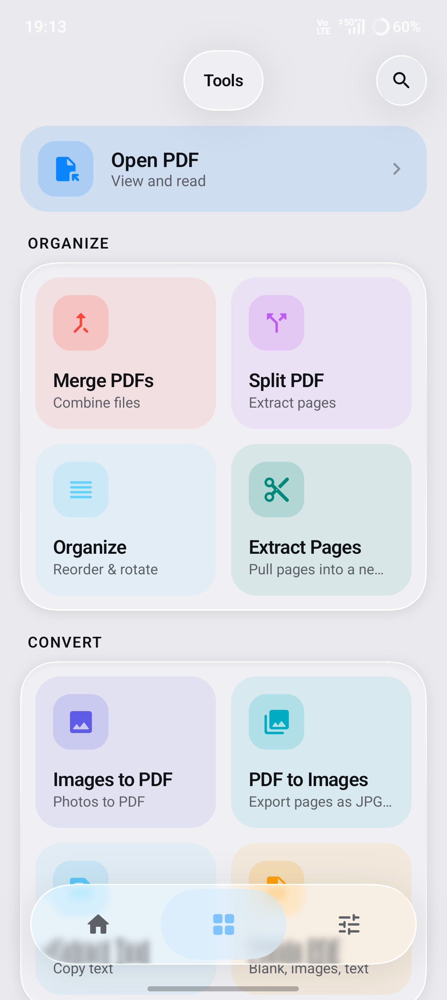
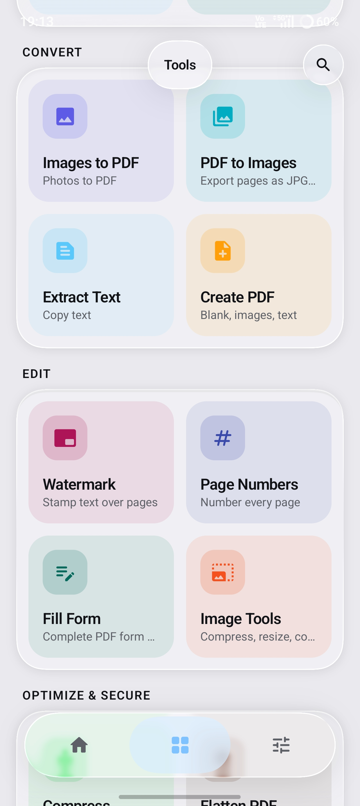

# ClearPDF

### Open-source PDF and document tools for Android.

Read and annotate PDFs, sign forms, work with Office documents, edit spreadsheets and images, and create PDFs on your phone. Built with Kotlin and Jetpack Compose.

  <a href="https://github.com/Chethan616/ClearPDF/releases/tag/v4"><strong>Download ClearPDF V4</strong></a>
  · <a href="https://github.com/Chethan616/ClearPDF/releases">All releases</a>
  · <a href="https://github.com/Chethan616/ClearPDF/issues/new/choose">Report a problem or request a feature</a>
  · <a href="CONTRIBUTING.md">Contribute</a>

  
  
  
  
  

ClearPDF is an Android document toolkit for reading and annotating PDFs, managing PDF pages, scanning paper documents, and opening common Office and image files. The source is licensed under MIT. Most file operations run on-device. The FOSS build uses network for its optional Office engine and URL-to-PDF features; Google Play services may provide scanner and background-removal components. See the [privacy notes](PRIVACY.md).

## Featured by HowToMen

ClearPDF was featured by HowToMen. [Watch the video from 0:18](https://www.youtube.com/watch?v=TYNzg59ke30&t=18s).

## Screenshots

  
  
  
  

  
  
  
  

Short walkthroughs: [onboarding](demo/1.mp4) · [PDF viewer](demo/2.mp4).

## What you can do

### Read and work with PDFs

- Read with continuous scrolling, pinch-to-zoom, page navigation, and in-document search.
- Select and copy text; run on-device OCR for image-only pages.
- Add highlights, underlines, strikethroughs, ink, shapes, arrows, text notes, and signatures.
- Fill PDF forms, flatten form fields, and export an annotated copy.
- Organize, rotate, delete, or extract pages; merge and split files.
- Compress, encrypt, or decrypt PDFs; add page numbers or watermarks; export pages as images; extract text; create PDFs from text or images.

### Open Office and text documents

Open PDF, DOC/DOCX, XLS/XLSX, PPT/PPTX, ODT/ODS/ODP, RTF, CSV, and TXT files. Rendering depends on the format and renderer. The optional LibreOffice-based engine can improve rendering for supported Office formats.

The spreadsheet editor can edit and save XLSX workbooks. Word and PowerPoint files are opened for viewing; ClearPDF does not rewrite their original text layout. You can annotate the rendered document and export it as a PDF.

### Edit images and scan paper

- Crop, rotate, straighten, and perspective-correct images.
- Adjust colour and tone, apply filters, draw, add text or watermarks, and resize.
- Remove image backgrounds on supported devices; Google Play services may provide the segmentation model.
- Scan multi-page documents, adjust the results, and save them as PDF. Scanning is provided by Google Play services and depends on its availability on the device.

### Create PDFs from local content or a web address

Create a PDF from images, text, or local HTML. The FOSS build can also convert a web address; this requests that site and its page resources. Local HTML conversion works without loading a website.

## Supported Android versions and formats

- **Android:** API 23 (Android 6.0) or newer.
- **Document formats:** PDF; DOC/DOCX; XLS/XLSX; PPT/PPTX; ODT/ODS/ODP; RTF; CSV; TXT.
- **Images:** PNG, JPEG, WebP, BMP, and HEIC are supported by the image/document flows. Feature availability can vary by device and Android version.

Only XLSX files have spreadsheet cell editing and save support. Other Office formats are viewed through the built-in or optional Office renderer; visual fidelity varies by document and renderer.

ClearPDF annotates PDFs and edits form fields, signatures, and pages, but it does not rewrite arbitrary text already printed into a PDF page. Likewise, Word and PowerPoint files are viewed and exported as PDF rather than edited in their original formats.

## Download

The current stable release is **V4 (app version 2.0.0)**. Open the [V4 release page](https://github.com/Chethan616/ClearPDF/releases/tag/v4) and choose the APK that matches your device:

| APK suffix | Choose it for |
|---|---|
| <code>-arm64-v8a.apk</code> | Most current 64-bit ARM phones and tablets |
| <code>-armeabi-v7a.apk</code> | 32-bit ARM devices |
| <code>-x86_64.apk</code> or <code>-x86.apk</code> | x86-based emulators and devices |
| <code>-universal.apk</code> | A larger package containing the release's supported ABIs |

The GitHub APKs are the FOSS distribution. The optional Office engine is downloaded only when requested in Settings. For future builds, use the [latest release page](https://github.com/Chethan616/ClearPDF/releases/latest). You can also add the repository to [Obtainium](https://github.com/ImranR98/Obtainium) for release update notifications.

## Privacy and network use

ClearPDF has no document-upload service. User-selected files are processed on-device. The FOSS build makes network requests for the optional Office engine download and web-address conversion. Google Play services may manage scanner or background-removal components. See [PRIVACY.md](PRIVACY.md) for details.

## Technology

- Kotlin, Android SDK, and Jetpack Compose.
- Android PdfRenderer and PdfBox-Android for PDF rendering and operations.
- Bundled on-device ML Kit text recognition and Tesseract OCR fallback.
- ML Kit Document Scanner for capture and page correction.
- GPUImage and local image-processing code for image tools.
- Optional LibreOffice-based Office engine; FOSS builds download it on request, while Play builds use on-demand feature delivery.
- The local <code>backdrop</code> module and AndroidLiquidGlass components provide the glass surfaces and motion.

## Build and run from source

### Requirements

- Android Studio with JDK 17 or newer.
- Android SDK Platform 36 and Android Build Tools 36.1.0.
- An Android device or emulator for running the app.

### Build a FOSS debug APK

~~~bash
git clone https://github.com/Chethan616/ClearPDF.git
cd ClearPDF
./gradlew :app:assembleFossDebug
~~~

On Windows, run <code>gradlew.bat :app:assembleFossDebug</code>. The APK is written under <code>app/build/outputs/apk/foss/debug/</code>.

### Build the sideload release APKs

~~~bash
./gradlew :app:assembleFossRelease
~~~

The ABI-split and universal APKs are written under <code>app/build/outputs/apk/foss/release/</code>. Release builds use local signing credentials when configured; otherwise the Gradle build uses the debug signing key and prints a warning. Do not distribute a debug-signed build as an official release.

For a Play bundle, use <code>./gradlew :app:bundlePlayRelease</code>. The Play build includes the optional Office engine as an on-demand feature. See the Gradle files for distribution-specific details.

### Project layout

| Path | Purpose |
|---|---|
| <code>app/</code> | Android app, UI, document viewers, tools, and image editor |
| <code>pdf-core/</code> | PDF operations and rendering support |
| <code>ocr-core/</code> | On-device OCR |
| <code>backdrop/</code> | Shared liquid-glass backdrop effects |
| <code>office_engine/</code> | Optional Play feature module, included for bundle builds |

To run the app from Android Studio, open the repository root, sync Gradle, and run the <code>app</code> module.

## Contributing and support

Issues and focused pull requests are welcome.

- [Report a bug](https://github.com/Chethan616/ClearPDF/issues/new?template=bug_report.yml).
- [Request a feature](https://github.com/Chethan616/ClearPDF/issues/new?template=feature_request.yml).
- Read the [contribution guide](CONTRIBUTING.md) and [Code of Conduct](CODE_OF_CONDUCT.md).
- Report a security concern through [SECURITY.md](SECURITY.md).
- Review known requests and reports in [all issues](https://github.com/Chethan616/ClearPDF/issues).

If ClearPDF is useful to you, starring the repository helps others discover it. Share the release page with someone who might need an open-source Android PDF toolkit.

## FAQ

<strong>Is ClearPDF open source?</strong>

Yes. The project is licensed under MIT; third-party components retain their own licenses and notices.

<strong>Can I use ClearPDF offline?</strong>

Most PDF, spreadsheet, image, and local-document operations run on-device. The FOSS build needs a connection to download the optional Office engine or convert a web address. Google Play services may also provide scanner or background-removal components. See <a href="PRIVACY.md">PRIVACY.md</a>.

<strong>Can I edit Word, PowerPoint, or existing PDF text?</strong>

ClearPDF can annotate PDFs, fill forms, add signatures, and manage pages, but it does not rewrite arbitrary existing PDF page text. Word and PowerPoint files are viewed and exported as PDF; XLSX cells can be edited and saved.

<strong>What Android version do I need?</strong>

Android 6.0 (API 23) or newer. Features provided by Google Play services may not be available on every device.

## Credits

- [AndroidLiquidGlass](https://github.com/Kyant0/AndroidLiquidGlass) by Kyant0 for backdrop and glass effects (Apache-2.0).
- [AndroidLiquidGlassView](https://github.com/QmDeve/AndroidLiquidGlassView) by QmDeve for motion techniques (MIT; see the project notices for the local implementation details).
- [PdfBox-Android](https://github.com/TomRoush/PdfBox-Android) by Tom Roush for PDF operations (Apache-2.0).
- [ImageToolbox](https://github.com/T8RIN/ImageToolbox) by T8RIN for adapted image-editor components (Apache-2.0).
- [GPUImage for Android](https://github.com/cats-oss/android-gpuimage) for image filters (Apache-2.0).
- [LibreOffice](https://www.libreoffice.org/) provides the optional Office engine (MPL-2.0); it is not bundled in the GitHub APKs.

See [THIRD_PARTY_NOTICES.md](THIRD_PARTY_NOTICES.md) for full attribution and license details. You can also [sponsor the project on GitHub](https://github.com/sponsors/Chethan616).

## License

ClearPDF is licensed under the [MIT License](LICENSE). Third-party licenses and attributions are listed in [THIRD_PARTY_NOTICES.md](THIRD_PARTY_NOTICES.md).
